# CAL-001 — AWS Networking Foundations

> Cloud Architect Lab Case Study

## Overview

This project establishes the foundational AWS networking infrastructure used throughout the Cloud Architect Lab portfolio.

The environment is fully deployed and managed using Terraform and demonstrates Infrastructure as Code (IaC) principles, AWS networking fundamentals, and enterprise documentation practices.

This case study serves as the networking foundation for future projects involving EC2, load balancing, NAT Gateways, high availability, multi-AZ architectures, VPC peering, hybrid networking, and AI workloads.

---

# Objectives

- Build a production-style Virtual Private Cloud (VPC)
- Manage infrastructure entirely with Terraform
- Demonstrate enterprise naming and tagging standards
- Document architecture decisions and validation evidence
- Establish reusable networking components for future case studies

---

# Current Architecture



---

# Current Infrastructure

The deployed environment currently includes:

- VPC
- Internet Gateway
- Public Subnet
- Private Subnet
- Public Route Table
- Private Route Table
- Public Route
- Route Table Associations
- Public Web Security Group
- Private Application Security Group

---

# Project Structure

```
aws-networking-foundations/
├── diagrams/
│   ├── exported/
│   └── source/
├── docs/
│   ├── architecture.md
│   ├── decisions.md
│   ├── deployment.md
│   ├── lessons-learned.md
│   └── validation.md
├── screenshots/
├── terraform/
└── README.md
```

---

# Documentation

| Document | Description |
|-----------|-------------|
| docs/architecture.md | Architecture overview and design decisions |
| docs/deployment.md | Deployment process and Terraform workflow |
| docs/validation.md | Infrastructure validation and AWS verification |
| docs/decisions.md | Architecture Decision Records (ADRs) |
| docs/lessons-learned.md | Project retrospective and future improvements |

---

# Validation

Deployment was verified through:

- Terraform validation
- Terraform plan/apply
- AWS Management Console verification
- Architecture comparison
- Terraform state validation

Detailed evidence is available in:

**docs/validation.md**

---

# Technologies

- AWS VPC
- AWS Internet Gateway
- AWS Route Tables
- AWS Security Groups
- Terraform
- Git
- GitHub
- LatixEngine

---

# Repository Highlights

This project demonstrates:

- Infrastructure as Code (IaC)
- Enterprise documentation
- Architecture as Code
- Reusable Terraform design
- Multi-AZ ready infrastructure
- Security-first networking

---

# Roadmap

Future milestones include:

- Multi-Availability Zone deployment
- NAT Gateway
- Bastion Host
- EC2 Web Tier
- Private Application Tier
- Application Load Balancer
- Auto Scaling
- VPC Flow Logs
- VPC Peering
- Transit Gateway
- Hybrid Connectivity

---

# Learning Outcomes

This project demonstrates practical experience with:

- AWS networking fundamentals
- Terraform resource management
- Security Group design
- Route table configuration
- Infrastructure validation
- Architecture documentation
- Git-based infrastructure workflows

---

# Author

**R.P.**

Cloud Architect Lab

Building practical AWS and AI architecture through real-world engineering case studies.