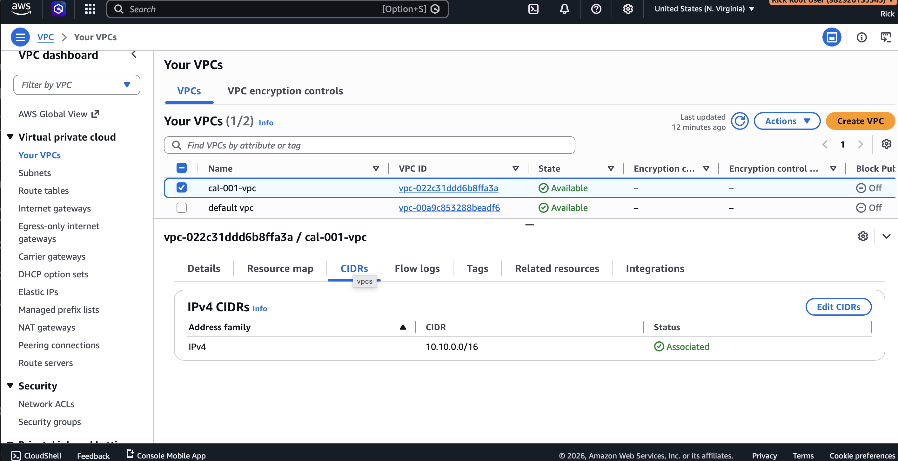
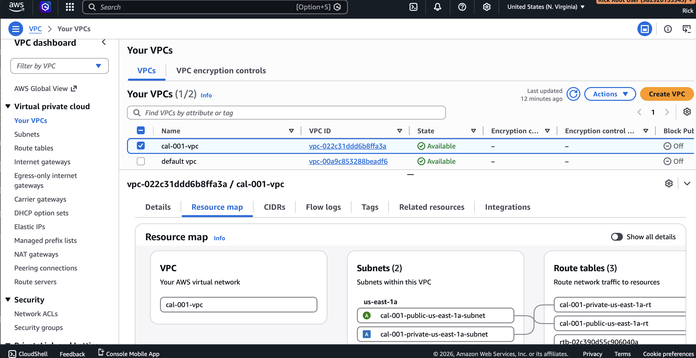
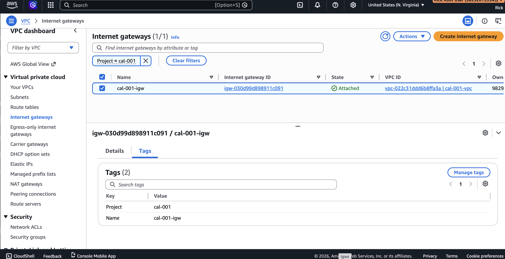
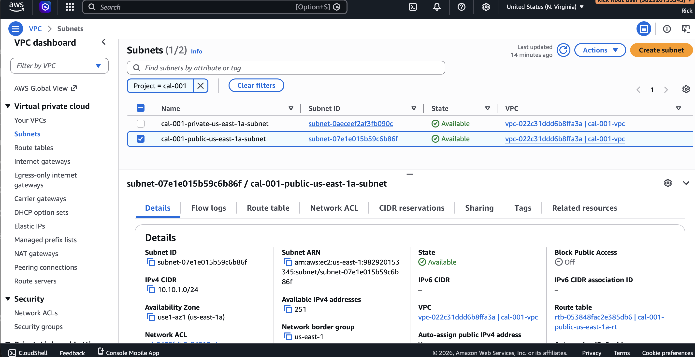
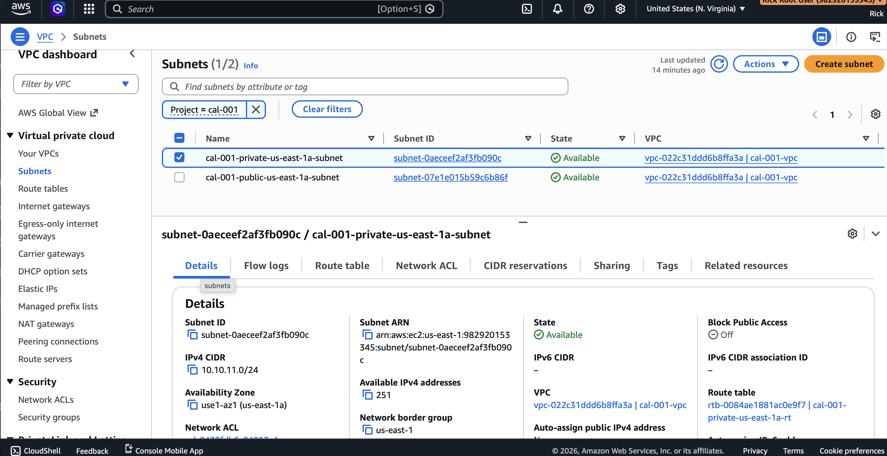
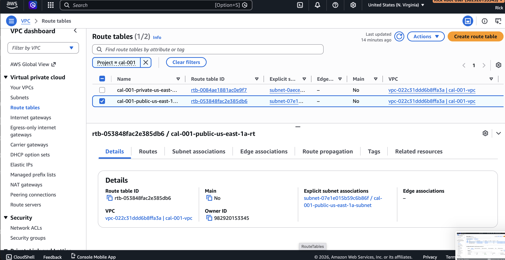
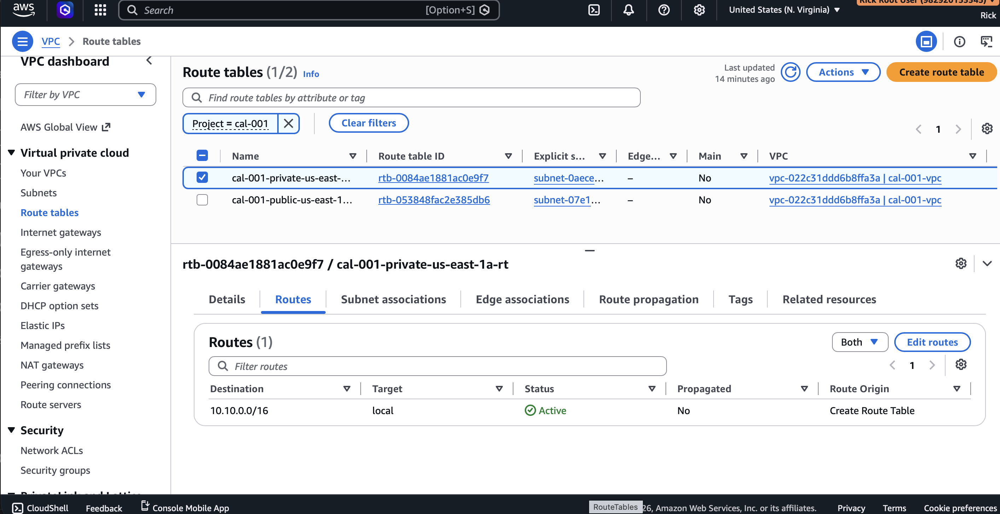
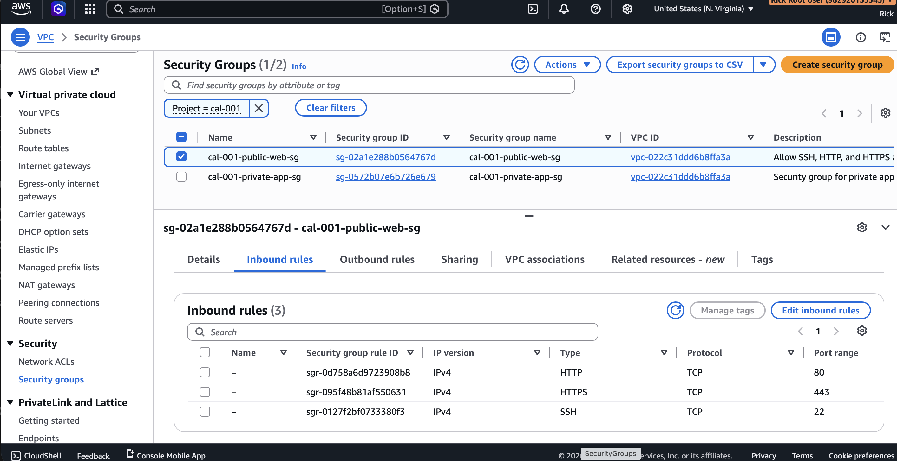
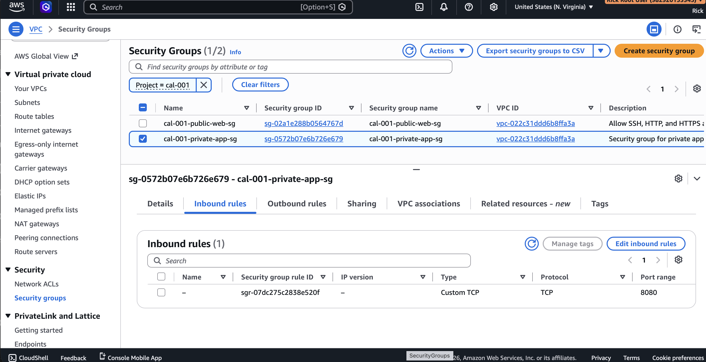

# Validation

## Purpose

This document records the validation activities performed after deployment to verify that the AWS infrastructure matches the Terraform configuration, intended architecture, and project documentation.

Validation consisted of:

- Terraform validation
- Infrastructure deployment verification
- AWS Management Console verification
- Architecture verification
- Terraform state verification

---

# Terraform Validation

The following Terraform commands completed successfully:

```bash
terraform fmt
terraform validate
terraform plan
terraform apply
```

Terraform completed without errors.

A subsequent validation using:

```bash
terraform plan
```

returned:

> No changes. Your infrastructure matches the configuration.

This confirms that the deployed infrastructure is fully synchronized with the Terraform state.

---

# AWS Console Validation

The deployed infrastructure was verified within the AWS Management Console.

The following resources were confirmed:

- VPC
- Internet Gateway
- Public Subnet
- Private Subnet
- Public Route Table
- Private Route Table
- Public Web Security Group
- Private Application Security Group

---

# Validation Evidence

## VPC Overview



Validation confirmed:

- VPC Name: **cal-001-vpc**
- CIDR Block: **10.10.0.0/16**
- Expected project tags applied

---

## Resource Map



The AWS Resource Map confirms the deployed relationships between:

- VPC
- Public Subnet
- Private Subnet
- Route Tables

---

## Internet Gateway



Validation confirmed:

- Internet Gateway attached to the project VPC
- Correct project tags applied

---

## Public Subnet



Validation confirmed:

- Availability Zone: **us-east-1a**
- CIDR Block: **10.10.1.0/24**
- Associated with the Public Route Table

---

## Private Subnet



Validation confirmed:

- Availability Zone: **us-east-1a**
- CIDR Block: **10.10.11.0/24**
- Associated with the Private Route Table

---

## Public Route Table



Validation confirmed:

- Local VPC route
- Default route (0.0.0.0/0) directed to the Internet Gateway

---

## Private Route Table



Validation confirmed:

- Local VPC route only
- No Internet Gateway route present

---

## Public Web Security Group



Validation confirmed inbound rules:

- HTTP (TCP 80)
- HTTPS (TCP 443)
- SSH (TCP 22) from the trusted administrator CIDR

Validation confirmed outbound rules:

- All outbound traffic permitted

---

## Private Application Security Group



Validation confirmed inbound rules:

- TCP 8080 from the Public Web Security Group

Validation confirmed outbound rules:

- All outbound traffic permitted

---

# Terraform State Verification

Terraform state accurately reflects the deployed infrastructure.

Infrastructure changes are managed exclusively through Terraform.

No manual modifications were made through the AWS Management Console following deployment.

---

# Architecture Verification

The deployed resources were compared against the architecture diagram.

Validation confirmed consistency between:

- Terraform configuration
- Terraform state
- AWS deployed resources
- Architecture diagram
- Project documentation

---

# Validation Summary

The CAL-001 networking environment deployed successfully and passed all validation activities.

The deployed infrastructure is operating as designed and provides the networking foundation for future case study milestones.

---

# Future Validation

Future milestones will expand validation activities to include:

- EC2 instance deployment
- Security Group traffic testing
- Route validation
- NAT Gateway validation
- Private subnet Internet connectivity
- Multi-AZ deployment validation
- High Availability testing
- VPC Peering validation